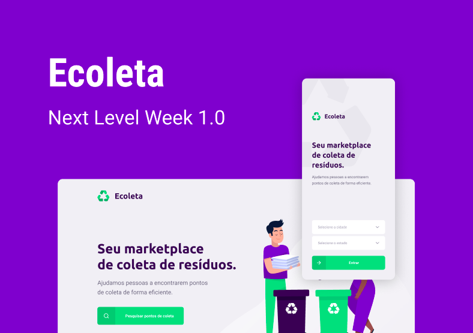

<h1 align="center">
    
</h1>

<h4 align="center">
  🚀 Next Level Week 1
</h4>

  

  <a href="#rocket-tecnologias">Tecnologias</a>&nbsp;&nbsp;&nbsp;|&nbsp;&nbsp;&nbsp;
  <a href="#-projeto">Projeto</a>&nbsp;&nbsp;&nbsp;|&nbsp;&nbsp;&nbsp;
  <a href="#-como-contribuir">Como utilizar</a>&nbsp;&nbsp;&nbsp;|&nbsp;&nbsp;&nbsp;
  <a href="#memo-licença">Licença</a>

 

  

## :rocket: Tecnologias

Esse projeto foi desenvolvido com as seguintes tecnologias:

- [TypeScript](https://www.typescriptlang.org/)
- [Node.js](https://nodejs.org/en/)
- [React](https://reactjs.org)
- [React Native](https://facebook.github.io/react-native/)
- [Expo](https://expo.io/)

## 💻 Projeto

O Ecoleta é um projeto que visa conectar pontos de coleta de materiais recicláveis com pessoas interessadas em descartar estes materiais.

## 🤔 Como utilizar

- Pré-requisitos

  - Possuir o [Node.js](https://nodejs.org/en/) instalado na máquina;
  - Ter um gerenciador de pacotes seja o [npm](https://www.npmjs.com/) ou o [yarn](https://yarnpkg.com/);
  - É essencial ter o [Expo](https://expo.io/) instalado de forma global na máquina.

- Faça um clone desse repositório: `git clone https://github.com/herickport/ecoleta.git`;

  ##### Depedências

  - `npm install`

  ##### Banco de Dados

  - `cd backend`
  - `npm run knex:migrate`
  - `npm run knex:seed`

  ##### Backend

  - `cd server/`
  - `npm run dev`

  ##### Frontend

  - `cd web/`
  - `npm start`

  ##### Mobile

  - `cd mobile/`
  - `npm start`

## :memo: Licença

Esse projeto está sob a licença MIT. Veja o arquivo [LICENSE](LICENSE) para mais detalhes.

---

Feito com ♥ by **Rocketseat / herickport** :wave:
